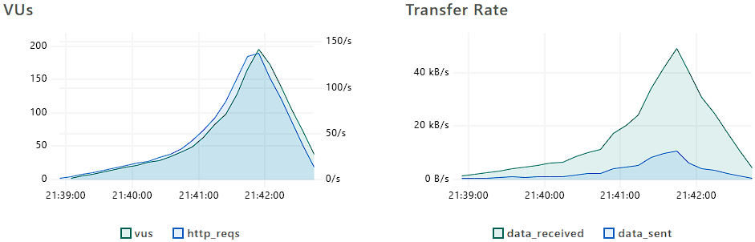

## 2ª Medição dos Testes de Carga

Link pra 1ª Medição dos Testes de Carga (versão antiga): [load-test-1/](../load-test-1/)

Serviço utilizado: [xk6](https://github.com/grafana/xk6) (k6 com extensões) / extensões: [xk6-faker](https://github.com/szkiba/xk6-faker) + [xk6-dashboard](https://github.com/grafana/xk6-dashboard)

Gerenciamento de Usuários
* Tipo de operações: leitura / inserção
* Arquivos envolvidos: [users.controller.ts](../src/users/users.controller.ts), [users.service.ts](../src/users/users.service.ts)
* Descrição das configurações (máquinas/containers utilizadas para o sistema funcionar, ...):
  - Cliente React: Nuvem Vercel
  - Servidor Nestjs (Nodejs Express): Nuvem Vercel
  - Conexao com Banco de Dados PostgreSQL: Nuvem Supabase
* Medição 1:
  * Data da medição: 07/08/2024
  * Arquivos com o código fonte de medição do SLA: [get-user.js](../load-test-1/scenarios/get-user.js), [post-user.js](../load-test-1/scenarios/post-user.js)
  * Testes de carga (SLA): latência, vazão e concorrência (limite de requisições simultâneas)
    - Requisições com latência média de 680ms (mínima de 294ms e pico de 2241ms) para leitura e 328ms (mínima de 280ms e pico de 1943ms) para inserção.
    - Vazão: 54.012687 requisições por segundo; 13.627488 iterações por segundo; 463 MB recebidos; 1.8 MB enviados
    - Concorrência: Suportou bem gradualmente a carga até 200 usuários simultâneos (VUs). Alguns picos de latência indicam que o desempenho pode ser afetado em situações de carga extrema.
  * Potenciais gargalos do sistema: 
    - A latência média de 680ms para leitura de usuários pode ser um gargalo para o sistema, principalmente em situações de carga extrema. A inserção de usuários, por outro lado, apresentou uma latência média de 328ms, o que é um valor aceitável para a maioria dos casos.
    - Apenas 29.41% das requisições de inserção de usuários (967/2320) foram bem-sucedidas, acreditamos que seja apenas um problema com a abordagem de inserção que causaram colisões de e-mail e CPF que são campos únicos.
  - (não foram feitos gráficos na 1ª medição)
* Medição 2:
  * Data da medição: 20/08/2024
  * Arquivos com o código fonte de medição do SLA: [get-user.js](./scenarios/get-user.js), [post-user.js](./scenarios/post-user.js)
  * Testes de carga (SLA): latência, vazão e concorrência (limite de requisições simultâneas)
    - Requisições com latência média de 338.7ms (mínima de 285.49ms e pico de 1.87s) para leitura e 329ms (mínima de 276ms e pico de 1s) para inserção.
    - Vazão: 47.59 requisições por segundo; 26.1 iterações por segundo; 20.1 MB recebidos; 7.49 MB enviados
    - Concorrência: Suportou bem gradualmente a carga até 200 usuários simultâneos (VUs). Alguns picos de latência indicam que o desempenho pode ser afetado em situações de carga extrema.
  * Comparativo:
    - Latência: 
    - Vazão: 
    - Concorrência: manteve-se.
  * Melhorias/otimizações:
    - O problema de colisões de e-mail e CPF foi resolvido com a geração de e-mails e CPFs aleatórios usando a extensao xk6-faker para os usuários inseridos, não houve a necessidade de alterar nada no servidor.
    - Ocorreu uma melhora significativa na latência média de leitura de usuários com o uso de paginação. 

Gerenciamento de Relatórios
* Tipo de operações: leitura / inserção
* Arquivos envolvidos: [reports.controller.ts](../src/reports/reports.controller.ts), [reports.service.ts](../src/reports/reports.service.ts)
* Descrição das configurações (máquinas/containers utilizadas para o sistema funcionar, ...):
  - (mesmo cliente e servidor)
  - Conexao com Banco de Dados Cassandra: Nuvem Datastax (AstraDB)
* Medição 1:
  * Data da medição: 07/08/2024
  * Arquivos com o código fonte de medição do SLA: [get-report.js](../load-test-1/scenarios/get-report.js), [post-report.js](../load-test-1/scenarios/post-report.js)
  * Testes de carga (SLA): latência, vazão e concorrência (limite de requisições simultâneas)
    - Requisições com latência média de 406ms (mínima de 181ms e pico de 1926ms) para leitura e 359ms (mínima de 302ms e pico de 1907ms) para inserção.
    - Vazão: (mesmo teste que o anterior)
    - Concorrência: (mesmo teste)
  * Potenciais gargalos do sistema
    - Similar ao teste com Usuário no PostgreSQL, aparentemente proporcional ao tamanho do dado.
  - (não foram feitos gráficos na 1ª medição)
* Medição 2:
  * Data da medição: 20/08/2024
  * Arquivos com o código fonte de medição do SLA: [get-report.js](./scenarios/get-report.js), [post-report.js](./scenarios/post-report.js)
  * Testes de carga (SLA): latência, vazão e concorrência (limite de requisições simultâneas)
    - Requisições com latência média de 290ms (mínima de 0ms e pico de 2.58s) para leitura e 357ms (mínima de 75ms e pico de 1.13s) para inserção.
    - Vazão: 22.7 kB/s recebidos; 3.32 kB/s enviados; 49.71/s requisições; 49.71/s iterações; 0.98/s checks
    - Concorrência: 5 VUs para leitura e 1 VU para inserção, com picos de 200 VUs.
  * Comparativo:
    - Latência: 
    - Vazão: 
    - Concorrência: manteve-se.
  * Melhorias/otimizações:
    - não parece ter houvido gargaos nas requisições, portanto não houve necessidade de otimizações por parte do servidor.

### Saída Teste-2 (20/08/2024 19:44:41)

get report:

[completo](https://htmlpreview.github.io/?https://gist.github.com/jrmsrs/6c9e628c07dc990366911727fbb0d50d/raw/f5fec50af012853562898613617234cec74f6f06/get-reports.html)


| Metric | Avg | Max | Med | Min | P90 | P95 | P99 |
| -- | -- | -- | -- | -- | -- | -- | -- |
get_report_duration | 290.91/s | 2.58k/s | 232.64/s | 0/s | 400.97/s | 615.32/s | 1.18k/s |
http_req_blocked | 4ms | 2s | 640ns | 0ms | 840ns | 950ns | 129ms |
http_req_connecting | 1ms | 1s | 0ms | 0ms | 0ms | 0ms | 48ms |
http_req_duration | 290ms | 2s | 232ms | 0ms | 400ms | 615ms | 1s |
http_req_receiving | 912µs | 95ms | 168µs | 0ms | 2ms | 3ms | 12ms |
http_req_sending | 105µs | 35ms | 72µs | 0ms | 134µs | 181µs | 431µs |
http_req_tls_handshaking | 2ms | 961ms | 0ms | 0ms | 0ms | 0ms | 76ms |
http_req_waiting | 289ms | 2s | 231ms | 0ms | 399ms | 611ms | 1s |
iteration_duration | 1s | 31s | 1s | 1s | 1s | 1s | 1s |

| Metric | Count | Rate |
| -- | -- | -- |
| data_received | 5.47 MB | 22.7 kB/s |
| data_sent | 799 kB | 3.32 kB/s |
| http_reqs | 12k | 49.71/s |
| iterations | 12k | 49.71/s |
| checks | -- | 0.98/s |
| get_report_fail_rate | -- | 0/s |
| get_report_reqs | -- | 1/s |
| get_report_success_rate | -- | 1/s |
| http_req_failed | -- | 0/s |
| vus | 5 | -- |
| vus_max | 200 | -- |

post report:

[completo](https://htmlpreview.github.io/?https://gist.github.com/jrmsrs/6c9e628c07dc990366911727fbb0d50d/raw/f5fec50af012853562898613617234cec74f6f06/post-reports.html)




| Metric | Avg | Max | Med | Min | P90 | P95 | P99 |
| -- | -- | -- | -- | -- | -- | -- | -- |
http_req_blocked | 1ms | 1s | 510ns | 210ns | 650ns | 730ns | 44ms |
http_req_connecting | 546µs | 1s | 0ms | 0ms | 0ms | 0ms | 7ms |
http_req_duration | 357ms | 1s | 346ms | 75ms | 394ms | 417ms | 534ms |
http_req_receiving | 266µs | 148ms | 111µs | 0ms | 374µs | 575µs | 1ms |
http_req_sending | 76µs | 13ms | 63µs | 17µs | 109µs | 130µs | 254µs |
http_req_tls_handshaking | 527µs | 100ms | 0ms | 0ms | 0ms | 0ms | 21ms |
http_req_waiting | 357ms | 1s | 345ms | 75ms | 394ms | 416ms | 534ms |
iteration_duration | 1s | 2s | 1s | 1s | 1s | 1s | 1s |
post_report_duration | 357.88/s | 1.13k/s | 346.02/s | 75.65/s | 394.96/s | 417.2/s | 534.38/s |

| Metric | Count | Rate |
| -- | -- | -- |
| data_received | 2.38 MB | 9.89 kB/s |
| data_sent | 1.02 MB | 4.24 kB/s |
| http_reqs | 6.3k | 26.1/s |
| iterations | 6.3k | 26.1/s |
| checks | -- | 1/s |
| http_req_failed | -- | 0/s |
| post_report_fail_rate | -- | 0/s |
| post_report_reqs | -- | 1/s |
| post_report_success_rate | -- | 1/s |
| vus | 1 | -- |
| vus_max | 200 | -- |

get user:

[completo](https://htmlpreview.github.io/?https://gist.github.com/jrmsrs/6c9e628c07dc990366911727fbb0d50d/raw/f5fec50af012853562898613617234cec74f6f06/get-users.html)


| Metric | Avg | Max | Med | Min | P90 | P95 | P99 |
| -- | -- | -- | -- | -- | -- | -- | -- |
get_user_duration | 338.7/s | 1.87k/s | 330.04/s | 285.49/s | 358.12/s | 405.53/s | 563.58/s |
http_req_blocked | 1ms | 1s | 570ns | 220ns | 750ns | 860ns | 41ms |
http_req_connecting | 550µs | 1s | 0ms | 0ms | 0ms | 0ms | 8ms |
http_req_duration | 338ms | 1s | 330ms | 285ms | 358ms | 405ms | 563ms |
http_req_receiving | 307µs | 80ms | 139µs | 24µs | 547µs | 893µs | 2ms |
http_req_sending | 101µs | 19ms | 70µs | 20µs | 128µs | 164µs | 407µs |
http_req_tls_handshaking | 526µs | 142ms | 0ms | 0ms | 0ms | 0ms | 21ms |
http_req_waiting | 338ms | 1s | 329ms | 285ms | 357ms | 403ms | 563ms |
iteration_duration | 1s | 2s | 1s | 1s | 1s | 1s | 1s |

| Metric | Count | Rate |
| -- | -- | -- |
| data_received | 20.1 MB | 83.4 kB/s |
| data_sent | 893 kB | 3.71 kB/s |
| http_reqs | 11.5k | 47.59/s |
| iterations | 11.5k | 47.59/s |
| checks | -- | 1/s |
| get_user_fail_rate | -- | 0/s |
| get_user_reqs | -- | 1/s |
| get_user_success_rate | -- | 1/s |
| http_req_failed | -- | 0/s |
| vus | 1 | -- |
| vus_max | 200 | -- |

post user:

[completo](https://htmlpreview.github.io/?https://gist.github.com/jrmsrs/6c9e628c07dc990366911727fbb0d50d/raw/f5fec50af012853562898613617234cec74f6f06/post-users.html)


| Metric | Avg | Max | Med | Min | P90 | P95 | P99 |
| -- | -- | -- | -- | -- | -- | -- | -- |
http_req_blocked | 242µs | 1s | 550ns | 260ns | 680ns | 760ns | 1µs |
http_req_connecting | 114µs | 1s | 0ms | 0ms | 0ms | 0ms | 0ms |
http_req_duration | 329ms | 1s | 311ms | 276ms | 360ms | 400ms | 592ms |
http_req_receiving | 389µs | 157ms | 119µs | 22µs | 658µs | 1ms | 3ms |
http_req_sending | 131µs | 156ms | 83µs | 29µs | 165µs | 219µs | 456µs |
http_req_tls_handshaking | 122µs | 96ms | 0ms | 0ms | 0ms | 0ms | 0ms |
http_req_waiting | 328ms | 1s | 311ms | 276ms | 359ms | 398ms | 592ms |
iteration_duration | 330ms | 1s | 312ms | 276ms | 362ms | 402ms | 594ms |
post_user_duration | 329.33/s | 1.97k/s | 311.9/s | 276.16/s | 360.73/s | 400.43/s | 592.58/s |

| Metric | Count | Rate |
| -- | -- | -- |
| data_received | 12.5 MB | 52.2 kB/s |
| data_sent | 7.49 MB | 31.2 kB/s |
| http_reqs | 46.3k | 192.66/s |
| iterations | 46.3k | 192.66/s |
| checks | -- | 1/s |
| http_req_failed | -- | 0/s |
| post_user_fail_rate | -- | 0/s |
| post_user_reqs | -- | 1/s |
| post_user_success_rate | -- | 1/s |
| vus | 1 | -- |
| vus_max | 200 | -- |

### Saída Teste-1 (07/08/2024 19:44:41)

```
          /\      |‾‾| /‾‾/   /‾‾/   
     /\  /  \     |  |/  /   /  /    
    /  \/    \    |     (   /   ‾‾\  
   /          \   |  |\  \ |  (‾)  | 
  / __________ \  |__| \__\ \_____/ .io

     execution: local
        script: ./load-test/index.js
        output: -

     scenarios: (100.00%) 1 scenario, 20 max VUs, 50s max duration (incl. graceful stop):
              * default: 20 looping VUs for 20s (gracefulStop: 30s)


     █ Endpoint User - Controller User  ticket-io-server-pi2.vercel.app

       ✗ max duration
        ↳  99% — ✓ 6562 / ✗ 41

     █ Endpoint Report - Controller Report  ticket-io-server-pi2.vercel.app

       ✗ max duration
        ↳  99% — ✓ 6526 / ✗ 14

     checks.........................: 99.58%  ✓ 13088     ✗ 55   
     data_received..................: 463 MB  1.9 MB/s
     data_sent......................: 1.8 MB  7.6 kB/s
     get_report_duration............: avg=406.244843 min=181.401984 med=405.89024  max=1926.278531 p(90)=553.046204 p(95)=581.51253 
     get_report_fail_rate...........: 0.00%   ✓ 0         ✗ 3275 
     get_report_reqs................: 100.00% ✓ 3275      ✗ 0    
     get_report_success_rate........: 100.00% ✓ 3275      ✗ 0    
     get_user_duration..............: avg=680.265869 min=294.128672 med=701.561054 max=2241.960002 p(90)=773.751281 p(95)=856.928968
   ✓ get_user_fail_rate.............: 0.00%   ✓ 0         ✗ 3316 
     get_user_reqs..................: 100.00% ✓ 3316      ✗ 0    
   ✓ get_user_success_rate..........: 100.00% ✓ 3316      ✗ 0    
     group_duration.................: avg=2.39s      min=1s         med=2.44s      max=3.81s       p(90)=2.87s      p(95)=2.93s     
     http_req_blocked...............: avg=898.79µs   min=220ns      med=551ns      max=1.05s       p(90)=702ns      p(95)=802ns     
     http_req_connecting............: avg=422.78µs   min=0s         med=0s         max=1.03s       p(90)=0s         p(95)=0s        
   ✓ http_req_duration..............: avg=444.32ms   min=181.4ms    med=356.85ms   max=2.24s       p(90)=717.32ms   p(95)=745.19ms  
       { expected_response:true }...: avg=469.3ms    min=181.4ms    med=386.77ms   max=2.24s       p(90)=725.32ms   p(95)=751.85ms  
     http_req_failed................: 17.65%  ✓ 2320      ✗ 10823
     http_req_receiving.............: avg=8.32ms     min=26.27µs    med=169.36µs   max=518.74ms    p(90)=22.84ms    p(95)=46.87ms   
     http_req_sending...............: avg=205.91µs   min=23.19µs    med=94.69µs    max=72.07ms     p(90)=186.76µs   p(95)=270.81µs  
     http_req_tls_handshaking.......: avg=428.67µs   min=0s         med=0s         max=120.39ms    p(90)=0s         p(95)=0s        
     http_req_waiting...............: avg=435.79ms   min=181.21ms   med=356.07ms   max=2.03s       p(90)=685.75ms   p(95)=709.01ms  
     http_reqs......................: 13143   54.012687/s
     iteration_duration.............: avg=4.75s      min=1s         med=4.81s      max=5.86s       p(90)=5.03s      p(95)=5.12s     
     iterations.....................: 3316    13.627488/s
     post_report_duration...........: avg=359.42913i0    
     post_user_success_rate.........: 29.41%  ✓ 967       ✗ 2320 
     vus............................: 2       min=1       max=200
     vus_max........................: 200     min=200     max=200


running (4m03.3s), 000/200 VUs, 3316 complete and 0 interrupted iterations
default ✓ [======================================] 000/200 VUs  4m0s
```
